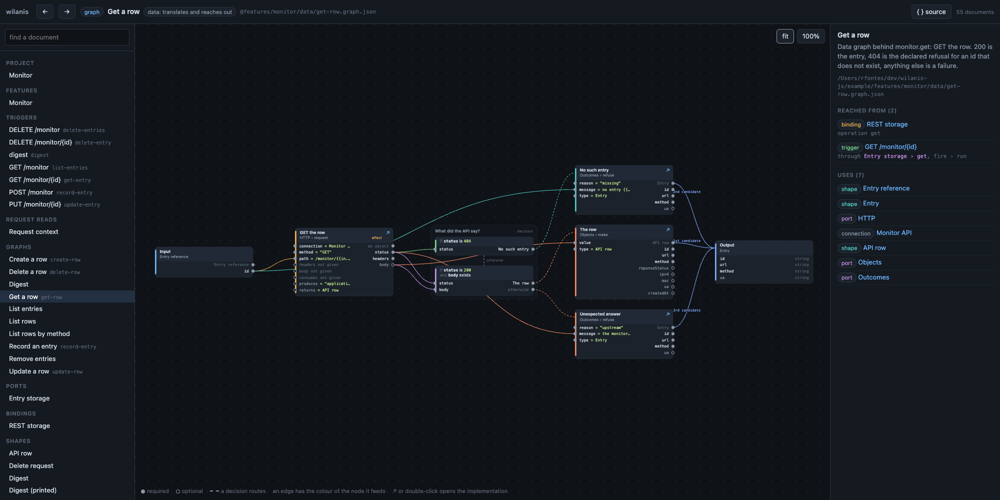

# wilanis

Build backend services without writing the glue code. You describe routes, contracts and data flows in
JSON files; a checker proves the description holds together before anything runs; a small runtime runs
it. An AI agent can write the files too, and the checker keeps it honest.

## The problem it solves

Most backend services are the same job over and over: accept a request, validate it, call a database or
another API, decide what the answer means, shape a response. In Express, Fastify, NestJS or their
equivalents, every one of those steps is a function you write by hand. Then you write tests that mock
`fetch`, and the mocks drift from reality. When the API you call adds a field, you edit a handler, a type,
a validator and a test, and hope you found them all.

The business rules are a small part of that code. The rest is plumbing, and the plumbing is where the
bugs live, because it is written fresh in every project and tested in none of them properly.

## What wilanis does instead

You do not write the plumbing. You write files that say what should happen, and the runtime does it.

A route is one file. This one is from the example project, `example/`, a small REST service in front of
a public API, shown without its `$schema` line and description:

```json
{
  "label": "GET /monitor/{id}",
  "kind": "@http/http.trigger-kind.json",
  "settings": {
    "route": "/monitor/{id}",
    "method": "GET",
    "produces": "application/json",
    "response": { "refusals": { "missing": 404, "upstream": 502 } }
  },
  "in": "@monitor/edge/IdRequest.shape.json",
  "out": "@monitor/edge/EntryView.shape.json",
  "fire": {
    "run": "@monitor/domain/monitor.port.json#get",
    "in": { "id": "{{request.params.id}}" }
  }
}
```

Read it top to bottom: a GET on `/monitor/{id}`, open to anyone since it names no policy, answering JSON. It takes an `IdRequest`
and answers an `EntryView`; both are shapes declared in their own files. It runs the `get` operation of
the `monitor` port with the id from the URL. If the operation refuses with reason `missing`, the client
gets a 404; with `upstream`, a 502.

The route does not say *how* `get` is done. That is a separate file, a graph, which fetches the row and
decides what the upstream's answer means. Three of its five nodes:

```json
{
  "label": "Get a row",
  "in": "@monitor/domain/EntryRef.shape.json",
  "out": { "type": "@monitor/domain/Entry.shape.json", "from": ["row", "missing", "failed"] },
  "nodes": [
    {
      "id": "asked",
      "type": "@wilanis/node/run.schema.json",
      "run": "@http/http.port.json#request",
      "in": {
        "connection": "@connections/monitor-api.connection.json",
        "method": "GET",
        "path": "/monitor/{{in.id}}",
        "produces": "application/json",
        "returns": "@monitor/edge/EntryRow.shape.json"
      }
    },
    {
      "id": "route",
      "type": "@wilanis/node/switch.schema.json",
      "in": { "status": "{{asked.status}}", "body": "{{asked.body}}" },
      "rules": [
        { "when": "status == 404", "to": "missing" },
        { "when": "status == 200 && has(body)", "to": "row" }
      ],
      "else": "failed"
    },
    {
      "id": "missing",
      "type": "@wilanis/node/run.schema.json",
      "run": "@std/outcome.port.json#refuse",
      "in": { "reason": "missing", "message": "no entry {{in.id}}", "type": "@monitor/domain/Entry.shape.json" }
    }
  ]
}
```

One request, one decision, one declared outcome per branch. A 404 from the API is not an exception here;
it is a case you named. Anything you did not name goes to `failed`, and the checker will not accept a
switch without an `else`.

### The checker reads it before you run it

`wilanis check` loads every file and verifies that they fit together: every reference points at a file
that exists, every operation you call exists on its port, every value you pass fits the type the operation
accepts, every graph's output fits what its caller expects, every effect a feature reaches is one it is
allowed to reach. Rename an operation in the port and forget the route, and you get this:

```
R001  @features/monitor/edge/get-entry.trigger.json#fire/run
    port '@monitor/domain/monitor.port.json' has no operation 'fetch' (operations: listAll, listByMethod, get, ...)
    → wilanis ls port

1 refusal(s)
```

The file, the path inside it, what is wrong, and the command that shows you the fix. This is what a
compiler does for typed code, applied to the whole service including the wiring between its parts.

### Every branch runs before you deploy

`wilanis rehearse` runs every route with the outside world stubbed. For every `switch`, it works out
which inputs reach each rule and runs that branch too, so a code path you never tested by hand is
exercised anyway:

```
features/monitor/data/get-row  switch 'route'  3/3 branches
  ok  when status == 404               refused on purpose at 'missing' as missing: "no entry golf"
  ok  when status == 200 && has(body)  answered from 'row'
  ok  anything else                    refused on purpose at 'failed' as upstream: "the monitor API answered 500"

every branch settled -- 37 branch(es), 15 decision(s), 15 graph(s).
```

A rule that no input can satisfy is reported as `NEVER RUN`: dead logic, or a hole in your routing,
found without writing a test. `wilanis fuzz` records runs as scenarios and `wilanis regress` replays them
and diffs the results, so a change that alters behaviour shows up as a diff, not a surprise.

### See the whole thing drawn

`wilanis-view` serves every file as a page and draws every graph. This is the `Get a row` graph from
above: the input on the left, the request, the decision on its status, the three outcomes, and the output
they converge on. Every box is a node in the file and every wire is a `{{reference}}`. The panel on the
right says who reaches this graph and what it uses; double-clicking a node opens what it runs.



## Why this is worth switching for

**There is almost no code, so there is almost nothing to test.** The example service has fourteen routes and
two CLI commands: a REST resource with batch deletion and a rate-limited upstream connection, CSV import and
export, sign-in against two directories, a session, role-based policies over every write, and a command
gated by a one-time code. It is about ninety JSON files of its own plus the fifty it includes, and zero lines
of JavaScript or TypeScript. The code that exists is generic and small: the engine that runs graphs is a
few hundred lines, the standard library of pure operations is one file under forty lines, the HTTP and auth
plugins a few hundred more each. None of it knows anything about your business. It is tested once, here,
and you never touch it.

**Small code has few reasons to change.** Code changes because the world changes: a new field, a new
route, a partner API that now returns 410 instead of 404. In wilanis every one of those is an edit to a
JSON file, and the checker judges the edit before it runs. The runtime changes only when a new *kind* of
thing becomes possible, which is rare. Fewer changes to code means fewer regressions in code.

**The tests you would have written are already written.** You do not mock `fetch` and hand-craft a 404.
`rehearse` derives the 404 case from your own switch rule and runs it. When you add a rule, its branch is
covered the moment you save.

**Your service is readable by someone who did not write it.** `wilanis map` prints how a request flows
from route to port to graph to upstream. `wilanis-view` draws every graph as boxes and arrows in the
browser. A new team member, or an auditor, reads the service without reading code.

**It is built for an AI agent to write.** The files are JSON on purpose. JSON gives structure and
strictness: every file has a schema, every key is either allowed or refused, and there is no syntax for a
model to get creative with. A JSON file cannot open a socket or read the disk; it can only point at other
files, and it can only call effects its feature explicitly allows. So an agent's mistakes are the checker's
refusals, each with a hint pointing at the fix. The agent reads the refusal, edits, checks again. In
practice a small, cheap model does this correctly and fast, because the loop is tight and every step is
verified. `wilanis init` writes a `CLAUDE.md` into your project that tells the agent the rules.

## Try it

Run the example, which talks to a public test API and needs no key. The one secret is the key its own
tokens are signed with:

```
git clone https://github.com/wilanis/wilanis-js && cd wilanis-js
npm install && npm run build
npx wilanis check example          # is the tree consistent?
npx wilanis rehearse example       # run every branch of every route and policy, world stubbed
npx wilanis map example            # how does a request flow, and what gates it?
npx wilanis-view example           # draw it, on http://127.0.0.1:4400/
export MONITOR_JWT_SECRET=$(openssl rand -base64 32)
npx wilanis start example          # run what its startup declares: on :8080
npx wilanis run @hello/edge/hello-gated.trigger.json example   # challenged until you answer with a one-time code
```

Start your own project:

```
mkdir board && cd board
npm init -y && npm install @wilanis/runtime @wilanis/plugin-http
npx wilanis new project board .    # project.json and package.json
npx wilanis init .                 # CLAUDE.md and hooks for an agent working in this tree
npx wilanis check .
```

## The words, in one paragraph each

**Shape.** A type: named fields with types, required unless said otherwise. Shapes have a layer: `edge`
shapes are what the outside world sends and expects; `core` shapes are yours. The misspelled field a
partner API returns lives in an edge shape and never reaches your domain.

**Port.** A contract: a set of operations, each with what it accepts and what it returns. A plugin grants
ports (`@http/http.port.json` has `request`); your feature declares its own (`monitor.port.json` has
`get`, `record`, `remove`). The domain talks to a port and never knows what is behind it.

**Binding.** How a port is met: for each operation, the graph that does it. Swap the binding and the same
domain runs against a different store, a fake, or a queue.

**Graph.** A data flow: nodes that run an operation, route on a condition (`switch`) or fan out over a
list (`map`). A node runs when its inputs are ready; independent nodes run concurrently. Values move by
reference: `{{asked.body}}` is the body of the node called `asked`.

**Trigger.** An entry point: an HTTP route, a CLI command, whatever a plugin offers. It names the port
operation to fire and where its inputs come from, and the policies that gate it. A trigger never names a graph.

**Policy.** A gate on a trigger: it fires a port operation over what the guard established about the caller
(`request.principal`, `request.session`, an answered challenge), and its graph allows by answering or refuses
with a reason the policy calls a denial or a challenge. Where a trigger attaches a policy it says where the
credential sits (`"in": { "token": "{{request.headers.authorization}}" }`); verifying it is the auth plugin's
job, never a graph's. A trigger with no policies is public. A session is opened when a token is issued and
carries attributes of a shape the project names; a graph reads and writes them through `@auth/session.port.json`,
keyed by `request.session.id`, and `wilanis describe` on the shape lists who writes what.

**Feature.** A directory with three subdirectories, and the directory is the layer: `edge/` holds
triggers, policies, edge shapes and resolvers; `domain/` holds the port, core shapes and business graphs;
`data/` holds the binding and the graphs that reach the world. `feature.json` lists the effects the feature
may use. A project may include features from another package (`@wilanis/access` ships sign-in, sessions and
the policies above) and bind the ports they leave open.

**Plugin.** An npm package exposing a `PluginModule`: the ports, trigger kinds and codecs it grants, each
as a JSON file you can open, and a handler function per operation. `@std` and `@cli` ship with the
runtime; `@http` is `@wilanis/plugin-http`, `@auth` is `@wilanis/plugin-auth`, the one plugin that identifies
callers. A project names its plugins in `project.json`.

## Packages

| Package | What it is | Depends on |
|---|---|---|
| `@wilanis/engine` | The kernel: stateless, clockless, runs a spec and answers a report | nothing |
| `@wilanis/core` | The document language: JSON Schemas, TypeScript model, type system, loader, Scope, plugin contract | engine, ajv |
| `@wilanis/compiler` | `checkTree` judges a loaded tree; `Compiler` lowers graphs to engine specs | core, engine |
| `@wilanis/runtime` | Embedder, gates (`rehearse`, `fuzz`, `regress`), discovery, serve, plugin packages, the `wilanis` CLI. Ships `@std` and `@cli` | core, engine, compiler |
| `@wilanis/plugin-http` | The `@http` plugin: routes, outbound requests, connections, body codecs (files as blobs), cookies | core, engine |
| `@wilanis/plugin-blob` | The `@blob` plugin: stored files read as CSV rows or text, and written back, through the blob registry | core, engine |
| `@wilanis/plugin-auth` | The `@auth` plugin: the guard that identifies callers -- our own tokens issued at sign-in against a directory, sessions with typed attributes, one-time challenges | core, engine, jose |
| `@wilanis/view` | The `wilanis-view` viewer: every graph drawn as a canvas of nodes, typed ports and edges, callers one click away. Read-only; it grants nothing and runs nothing | core, compiler, runtime |
| `@wilanis/access` | Not a toolchain package but a tree to include: sign-in against directories that all end in the tree's own token, sessions with typed attributes, the policies (signed in, employees only, a role, a one-time code) and the command that issues a code. Pure JSON | plugin-auth, plugin-http at run time |

A project installs `@wilanis/runtime`, the plugin packages it uses, and the trees it includes. Nothing else.
`@wilanis/view` is a development tool for whoever wants to see the tree drawn.

## Reference: the model in one page

Skip this on a first read. It is the compact statement of the rules the checker enforces.

- **Documents.** One JSON file each. The `$schema` names the kind: `https://raw.githubusercontent.com/wilanis/wilanis-js/schemas-v1/packages/core/schemas/graph.schema.json`, or the alias `@wilanis/graph.schema.json`.
- **References are paths.** `@features/tasks/tasks.port.json`; `project.json` declares aliases (`@tasks` → `@features/tasks`); plugins are alias roots (`@std`, `@http`); an operation is `path#operation`.
- **A feature is three directories.** `features/<name>/edge/` holds the triggers, the shapes the world speaks and the resolvers; `domain/` the port, the core shapes and the graphs that hold business rules; `data/` the binding and the graphs that translate and reach effects. The directory *is* the layer: the checker reads it off the path (D008) and never infers it from who references a document.
- **Shapes** have a layer: `edge` (what the world imposes) or `core` (ours). An edge shape lives in `edge/`, a core shape in `domain/`. `unknown` exists only in edge shapes and native contracts.
- **Ports** are contracts: operations with `accepts` and `returns`. Granted by a plugin → native (the plugin implements it). In a feature → domain (a **binding** implements it, per operation: a data graph, or a delegation `run` + `in`).
- **One way in.** A node's `in` gives every value an operation takes, in one grammar: a literal as written, or `{{asked.status}}` to read another node, the graph's `in`, a constant (`{{const.initial}}`) or a resolver; embedded in text, a template interpolates (`"/tasks/{{in.id}}"`). A key that is not an identifier is quoted in brackets: `{{request.headers['user-agent']}}`. A contract marks the fields that must be literals `static` (a connection, a content type); a `type` field always is.
- **Graphs** are dataflow. Nodes are explicit types: `@wilanis/node/run.schema.json`, `switch`, `map`. A node runs when its sources settled. `switch` routes to exactly one node and cancels the rest; `has(x)` in a rule proves `x` present for the routed node. Reconvergence only at `out.from`.
- **Types are declared, never inferred.** `object#make`, `object#merge`, `list#first`, `list#concat`, `http#request` take a `type` or `returns` field naming the result type; the checker verifies the values given fit it.
- **The standard library is four ports.** `@std/object` (`make`, `merge`), `@std/text` (`fill`, `join`, `split`, `replace`), `@std/list` (`count`, `first`, `concat`, `slice`), `@std/outcome` (`refuse`). All pure, legal in any layer.
- **No absence.** Required unless `required: false`; optional cannot feed required; a missing key stays missing.
- **Files are blobs.** A `blob` is a type: the value is a handle (id, contentType, size, filename) and the bytes live once, on disk, in the runtime's blob registry (`project.json → blobs.dir`). An upload streams into the registry through a content type mapped to `@http/codecs/blob.codec.json` and the graph gets the handle; a download is a trigger whose `out` is `blob`, streamed back out. `@blob/csv.port.json` reads a blob as rows of a declared shape and writes rows as one; every such operation is an effect, in a data graph. Nothing of a file passes through the engine. A run's blobs are released once the trigger has answered.
- **Triggers are generic.** A trigger names its kind (http route, cli command, ...), the settings that kind judges, edge `in`/`out` types, and `fire`: the domain port operation it runs, with its inputs read from the kind's context (`{{request.body.title}}`). A trigger never names a graph; the port's binding decides how the operation is met.
- **Access is a trigger's declaration, and a policy's decision.** A trigger attaches the policies that gate it, in order, and where it attaches one it gives the guard the credentials it verifies, read from the kind's context like any input: `{ "policy": "@access/edge/employees-only.policy.json", "in": { "token": ["{{request.headers.authorization}}", "{{request.cookies.session}}"] } }` -- a list is the places a credential may sit, the first present wins; a later policy written bare reuses what an earlier one gave. A **policy** lives in `edge/` and fires a domain operation the way a trigger does, reading what the guard hands: `request.principal`, `request.session`, `request.challenge`. Its graph allows by answering and refuses with a reason; `outcomes` says whether a reason is a `deny` or a `challenge`, and the trigger maps every reason it can reach, the policies' included (T005). Validating a credential happens in the guarding plugin, before any policy, never in a graph, and the guard's `plugin.json` says which credentials it verifies (`token`, `challenge`) and what each yields; a trigger with no policies is public. `has(principal) && 'recorder' in principal.roles` is a rule: `in` looks into a list, and what `has()` proves on the left of `&&` may be read on the right.
- **A tree includes trees.** `project.json → includes` names npm packages whose `features/` load as if they sat here -- the same paths, the same rules, visible through `exports` and `dependsOn`, bound by bindings and profiles -- and whose aliases come along. Connections, plugins, settings, startup and profiles are the host's; a port the include leaves unbound is the host's to bind. `@wilanis/access` is such a tree: sign-in, sessions, policies and one-time codes, with `identity.port.json` for the host to bind to its directories.
- **Resolvers are reads.** A `resolvers` document in a feature's `edge/` names what the data layer takes from the request (`request.headers['user-agent']`); a data graph or a binding names the document and reads `{{agent}}`. `request.*` is legal in a trigger's `fire.in`, a policy's `decide.in` and a resolver's `read`; nowhere else. A resolver declared `required` is read as present, and every trigger reaching it must guarantee it: its kind hands the path always, or a policy of the trigger lists it under `proves` (A006).
- **Effects are explicit.** `http.request` answers status, headers, body. Whether 404 is a failure is a `switch`'s decision: the body is judged against `returns` only on a 2xx, so an error body reaches the switch. A node fails only on the unexpected.
- **Engine.** Stateless, clockless; runs all ready nodes concurrently; `blocked` + `needs` when input is missing; any node's value can be pre-supplied (replay); nested reports for binding graphs; secret redaction.

### project.json: plugins and hooks

```json
"plugins": [
  { "use": "@std" },
  { "use": "@cli" },
  { "use": "@http", "from": "@wilanis/plugin-http", "settings": { "port": 8080, "codecs": { "application/json": "@http/codecs/json.codec.json" } } }
]
```

`use` is the alias root. `from` is the npm package that ships it, imported by the runtime from the
project's own `node_modules`. It is a package name and nothing else: a JSON document can never point at a
file on disk. `@std` and `@cli` are built into the runtime and take no `from`.

```json
"includes": [{ "from": "@wilanis/access", "features": ["access"] }]
```

An include is the same idea for documents: a package that is a wilanis tree, whose named features load as
if they sat in this one. Its aliases come along (D007 on a collision), a feature both here and there is
refused (D009), and a package that is not a tree, or one using a plugin this project does not name, is D010.
`wilanis describe` and the viewer say `included from @wilanis/access` and name the file under `node_modules`.

A plugin package exports its `PluginModule` as the default export. Three hooks on it:

- `check(ctx)` adds the plugin's own rules (the `X` codes) to `wilanis check`.
- `guard` -- on the one plugin that identifies callers, declared in its `plugin.json` -- is called by the
  runtime around every fire of a trigger that attaches a policy, for every trigger kind alike:
  `identify` reads and verifies the credential and hands `request.principal`, `request.session`,
  `request.challenge`; `challenge` opens a challenge a policy asked for; `settle` spends what was single-use.
  The stubbed gates never call it.
- `postLoad(ctx)` runs once after the tree is loaded and judged, before any trigger starts, with the
  plugin's settings (secrets substituted), the registry, the scope and the environment. Open connections,
  warm caches, register parsers here. It may hand back a teardown, run when the runtime stops. `start`
  and a real `run` call it; the stubbed gates (`rehearse`, `fuzz`, `regress`, `run --seed`) do not.

### What a tree starts

`postLoad` is a plugin's own wiring, written in TypeScript, and a reader of the tree cannot see it. What
*this* project starts is declared instead, in `project.json → startup`:

```json
"startup": [
  { "label": "Open the pool", "run": "@board/domain/store.port.json#open" },
  { "label": "Watch for changes", "run": "@reload/watch.port.json#watch" },
  { "label": "Listen", "run": "@http/server.port.json#listen" }
]
```

`wilanis start` runs every plugin's `postLoad`, then these steps in order -- and nothing else. **The HTTP
server opens because the last step says so.** Delete it and nothing listens: no runtime decides on its own
that a tree with http triggers should open a port.

Each step names one port operation. Most name a **domain port**, so the active profile's binding decides how
it is met -- a fake in development, the real connection in production, without touching the step. Its `in` is
written as literals and `{{secrets.*}}`; nothing has been received yet, so a step that reads `request.*` --
or whose bound graph does -- is refused before it ever runs (B007, B008).

A step may also name a `holds` operation: one that starts something outliving the run -- a listener, a
watcher, a subscription. A plugin grants it, `wilanis describe` marks it `(holds until stopped)`, and the
runtime stops what it started, in reverse, when the process ends. A graph may never run one (L008): what
answers a request cannot start a server.

A step that refuses stops the start and exits nonzero: a tree whose database is unreachable never opens its
port, rather than answering every route with a fault. Say `"required": false` for a step the tree can serve
without, and its refusal is logged while the rest go on.

```
$ npx wilanis start example
startup 1/3 Reach the entry store: ok
reload: watching /path/to/example -- an edit is served once it passes wilanis check
startup 2/3 Watch for changes: ok
http: listening on :8080 -- GET /monitor → @monitor/domain/monitor.port.json#list, ...
startup 3/3 Listen: ok
```

With `@reload` in the list, editing a document serves the new tree without closing the port; a change that
does not pass `wilanis check` is reported and the last good tree keeps answering.

### Schemas

The schemas live in `packages/core/schemas/` and are published from the `schemas-v1` branch of this
repository, so every document can name its schema by URL and an editor can fetch it:

```
https://raw.githubusercontent.com/wilanis/wilanis-js/schemas-v1/packages/core/schemas/<kind>.schema.json
```

The branch name carries the schema major version. A breaking change to a schema goes to `schemas-v2`;
documents written against v1 keep validating. Node types are documents of their own under `node/`, listed
in `graph.schema.json`.

## Developing this repository

It is an npm workspace. `npm run build` builds every package through TypeScript project references,
`npm test` builds and runs the tests, `npm run release` publishes every package in dependency order.
`CLAUDE.md` describes the layout and the rules for changing it.

## License

Apache-2.0. See `LICENSE`.
